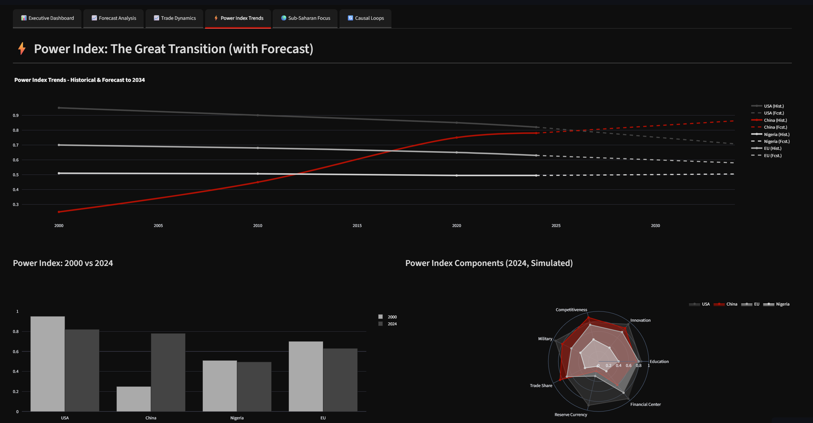

<h1 style="
  font-size: 3.5em;
  font-weight: 900;
  text-align: center;
  background: linear-gradient(to right, #1f4e79, #00b4d8);
  -webkit-background-clip: text;
  -webkit-text-fill-color: transparent;
">
  Modern Mercantilism Dashboard
</h1>

Quantsultant™© 2025 build. 




Amassed 386,585 XPS on DataCamp, has 0 chill.

One-sit full-stack deployment. 

All I needed were red & black screenshots, and then I just made an app while I was at it. RLHF feedback. Mercantilism decoded.


During the summer of 2025, I was invited to apply to Bridgewater Associates and Global Citizen's Summer Internship contest. Based on the legendary Ray Dalio's "The Changing World Order," an absolutely enlightening framework about the greater macroeconomic cycles of the rise and fall of empires. According to Dalio and the associates at Bridgewater, we have entered a new era donned Modern Mercantilism, defined by protectionism, firm borders, strategic alliances and friendshoring, anti-immigration, Built on this framework, I decided to look into the next 25 years and model predictions of events that will shape the world as we know it.  

The Modern Mercantilism Dashboard:
An interactive dashboard to explore contemporary trade imbalances, capital flows, and policy levers through the lens of modern mercantilism. Built with a focus on modular ML pipelines, narrative-driven visualizations, and serverless deployment.

Here’s the skill stack embedded in your **Modern Mercantilism Dashboard**—cleaned, categorized, and ready for README or pitch deck drop-in:

---

## 🧰 Core Libraries & Tools

### 📊 Data & Analysis
- **Pandas** – data wrangling and time-series manipulation  
- **NumPy** – numerical operations and array handling  
- **SciPy** – statistical modeling (if used in forecasting)

### 📈 Visualization
- **Plotly** – interactive charts and choropleth maps  
- **Matplotlib / Seaborn** – optional for static plots or masked heatmaps  
- **Streamlit** – dashboard framework with interactivity baked in

### 🔮 Modeling & Forecasting
- **Scikit-learn** – ML pipelines, regression models, and evaluation  
- **Statsmodels** – time-series forecasting (if ARIMA or similar used)

### 🧱 Modular Architecture
- **Custom Python modules** – for ETL, forecasting, feedback, and viz  
- **Serverless-ready packaging** – AWS Lambda + API Gateway compatible

### ☁️ Deployment & Infra
- **Docker** – containerization for local or cloud deployment  
- **AWS Lambda** – serverless execution of core modules  
- **API Gateway** – exposing endpoints for modular access

---

##  🧮 Skills Demonstrated

- Full-stack dashboard architecture  
- Modular ML pipeline design  
- Interactive data visualization  
- Clean ETL and data hygiene practices  
- Serverless deployment strategy  
- Strategic narrative framing for economic systems

---

## 🚀 Quick Start

1. **Clone the repo**  
   ```bash
   git clone https://github.com/GarrickPinon/modern_mercantilism_dashboard.git
   cd modern_mercantilism_dashboard
   ```
2. **Create & activate virtual env**  
   ```bash
   python3 -m venv .venv
   source .venv/bin/activate
   ```
3. **Install dependencies**  
   ```bash
   pip install -r requirements.txt
   ```
4. **Launch dashboard locally**  
   ```bash
   streamlit run app.py
   ```


🔍 Features (Updated)
Dynamic time-series analysis of trade surpluses/deficits

Country-level choropleth maps with masked heatmaps

Interactive dashboard elements for exploratory analysis

Modular ETL & ML pipelines for forecasting trade flows

Serverless deployment-ready (AWS Lambda + API Gateway)

---

## 📂 Repo Structure

```
.
├── app.py                   # Streamlit entrypoint
├── data/
│   ├── raw/                 # Original CSV/JSON exports
│   └── processed/           # Cleaned & aggregated datasets
├── modules/
│   ├── etl.py               # Extraction & transformation logic
│   ├── forecasting.py       # ML pipeline definitions
│   ├── feedback.py          # RLHF feedback loop
│   └── viz.py               # Plotting utilities
├── requirements.txt
└── README.md
```

---

## 📥 Data Sources

- World Bank trade statistics API  
- IMF Direction of Trade data  
- Custom scraped policy announcements  
- (Future) proprietary macro-financial databases

---

## 🛠️ Deployment

- **Serverless**:  
  - Package `modules/etl.py` and `modules/forecasting.py` as AWS Lambda functions  
  - Expose via API Gateway  
- **Containerized**:  
  - `docker build -t modern-mercantilism-dashboard .`  
  - `docker run -p 8501:8501 modern-mercantilism-dashboard`

---
### 📊 Statistical & Mathematical Foundations
- **Bayesian Inference** – posterior weighting, belief updating, and probabilistic scoring  
- **Monte Carlo Methods** – stochastic sampling and uncertainty quantification  
- **Sentiment Analysis** – NLP-driven signal extraction from policy and media text  
- **Linear Algebra** – vectorized representations, matrix ops, and dimensionality reduction  
- **Optimization** – likelihood maximization, regularization, and model calibration  
- **Information Theory** – entropy, KL divergence, and signal-to-noise diagnostics  
- **Probability Theory** – conditional distributions, expectation, and variance modeling  
- **Calculus** – integration over distributions, gradient-based tuning

### 🧬 Proprietary Scoring Model
A proprietary, tailored, Bayesian-weighted scoring model that fuses sentiment priors with trade signals to forecast strategic asymmetries. Designed for clarity, calibrated for impact.

---

## 🤝 Contributing: We are stronger together.

1. Fork the repo  
2. Create feature branch (`git checkout -b feature/your-feature`)  
3. Commit changes & push  
4. Open a PR and describe your enhancement  

---

## 📄 License

MIT © 2025 Garrick Piñón. All rights reserved.
**Quantsultant™** is a trademark of Garrick Piñón


---

### Waiting to hear back to publish this but once it's visible let me know if you'd like for me to publish any of the following next steps:

- Integrate RLHF spot-checking to refine the forecasting model  
- Add A/B testing for visualization choices (gradient vs. discrete color scales)  
- Package each module as an independent microservice for plug-and-play  
- Wire up incremental data ingestion with scheduling (e.g., Airflow, AWS EventBridge)  
- Draft narrative case studies comparing mercantilist tactics across regions
